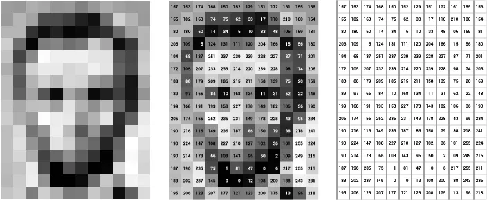
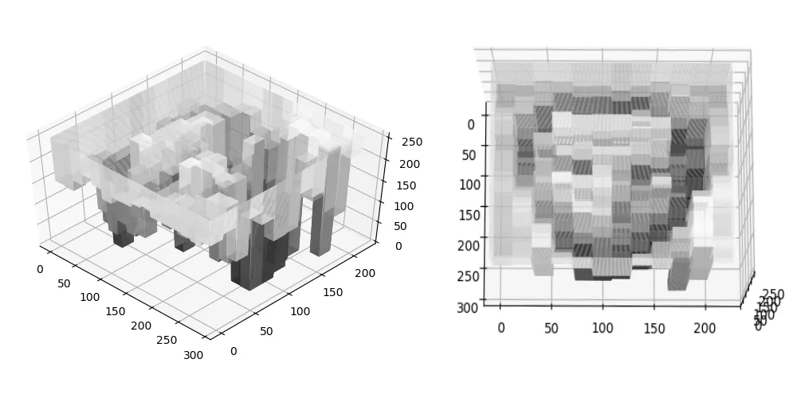
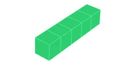
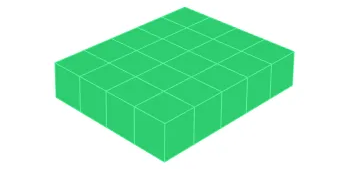
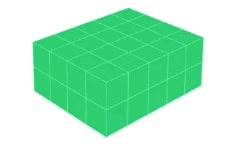
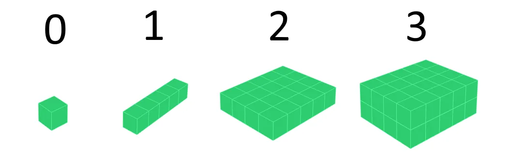
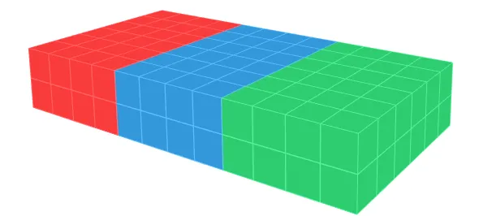
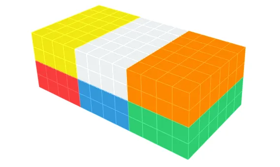

# Data In the Real World

Here we introduce the definition, notation and terminology for various kinds of data, more generally called ***tensors***.

In Artificial Intelligece and Machine Learning, tensors are multi-dimensional arrays (MDAs). Conceptually, they are an extension of the idea of a vector to multiple dimensions.

More formally, we denote an ***order-K*** or ***K-way*** tensor as a real K-dimensional array:

$$
\mathbf{A} \in \mathbb{R}^{N_1 \times N_2 \times \cdots \times N_K}
$$

Higher-dimensional tensors often represent “raw” forms of complex data, such as text, images, audio snippets and videos.

However, if you have ever created a Pandas DataFrame, you may have come across the realization of a one-dimensional tensor i.e. a vector, representing a single row of data.

## Lower-order tensors

Lower-order tensors are so often used, that we have distinct names for them:

| Order (K) | Name                          | Notation                                                | Example                                                                | Realized example                                                         |
|-----------|-------------------------------|---------------------------------------------------------|------------------------------------------------------------------------|-----------------|
| 0         | ***Scalar***                  | Greek: $\alpha,$ $\beta,$ $\gamma,$ etc                 | $\alpha \in \mathbb{R}$                                                | $\alpha = 5$                                                             |
| 1         | ***Vector***                  | Latin lowercase: $\textbf{x},$ $\textbf{x},$ etc.       | $\textbf{x} \in \mathbb{R}^d$                                          | $\textbf{x} = \begin{bmatrix} 1 \\ 2 \\ 3 \end{bmatrix}$                 |
| 2         | ***Matrix, Dyad***      | Latin uppercase: **A**, **B**, etc.                     | $\mathbf{A} \in \mathbb{R}^{m \times n}$                               | $\textbf{A} = \begin{bmatrix} 45 & 42 & 69 \\ 18 & 23 & 8 \end{bmatrix}$ |
| 3+        | ***Polyad*** | Calligraphic uppercase: $\mathcal{A}, \mathcal{X}$, etc | $\mathcal{A} \in \mathbb{R}^{N_1 \times \cdots \times N_K}$ | Hard to visualize                                                        |

You might have come across scalars, vectors and matrices before, so you might be familiar with reasoning about them.

But what about higher-order tensors? To build an intuition, let’s start with a real-world example using vectors.

## Vectors

Imagine we have gotten a hold of housing data from the latest census. We have a number of houses, each with various parameters of the house, such as number of bedrooms, number of bathrooms, area (in square feet), and number of stories.

-   We can represent each house in this example as a vector:

$$
\mathbf{x} = 
\begin{bmatrix}
\textbf{Bedrooms} & \textbf{Bathrooms} & \textbf{Area} & \textbf{Stories} \\
5 & 3 & 1800 & 2
\end{bmatrix}
$$

Each of these variables (often called *features* in a Machine Learning context) has a particular *range* in which it can take values.

| Variable | Bedrooms     | Bathrooms | Area |  Stories |
|----------|--------------|-----------|------|----------|
| Range    | 2–8          | 1-5 | 800–5500 | 1–3 |

You can imagine this vector to be similar to a combination bicycle lock, with a range different than the standard 0–9. Spinning the dials allows you to create different vectors. However, while each of the variables can take any real value, the *number* of variables is 4.

Thus, when we say we have a vector $\mathbf{x} \in \mathbb{R}^4$, we mean we have a linear array of 4 variables:

$$
\mathbf{x} = \begin{bmatrix} x_1 & x_2 & x_3 & x_4 \end{bmatrix}
$$

## Matrices

The situation is similar for matrices. An $\mathbb{R}^{12 \times 16}$ matrix means we have $12 \times 16 = 192$ variables, each of which might take values in the range $0$–$255$ (if this matrix represents an image, like the image of Abraham Lincoln below).

In this case, the image is *still* an order-2 tensor. **The order of a tensor tells us the number of dimensions along which it has variables.**

In the example below, there are two dimensions: one with 12 variables and one with 16 variables (usually denoted by $x$ and $y$ axes). We can index each variable of this matrix using the notation: $A_{i, j}, \text{where} i \in \{0, \ldots, 11\} \text{an } j \in \{0, \ldots, 15\}$

In Python, if our matrix `A` was a NumPy ndarray, we would access each element as: `A[i, j]`

{fig-alt="An image matrix of Abraham Lincoln"}

{fig-alt="3D Intensity plot of Abraham Lincoln"}

## Tensors

A K-order tensor is just an extension of the above concepts to additional dimensions.

### Scalar (order 0)

Let’s start slow. Imagine, if you will, a box that “contains” a real-valued variable. We can say this represents a scalar, e.g. $\alpha \in \mathbb{R}$

{fig-alt="Tensor of order-0"}

### Vector (order 1)

Now, let’s copy the box a certain number of times along a single dimension — say, 5 times. This will represent a vector, e.g.$\mathbf{a} \in \mathbb{R}^5$ This will have 5 variables, which we can access as $a_1, \dots, a_5$.

{fig-alt="Tensor of order-1"}

### Matrix (order 2)

Let’s copy this *vector* 4 times along another dimension. This now becomes a $5 \times 4$ matrix: $A \in \mathbb{R}^{5 \times 4}$

We access each variable (box) as: $A_{i, j} \text{, where } i \in \{1, ..., 5\} \text{ and } j \in \{1, \ldots, 4\}$.

{fig-alt="Tensor of order-2"}

### Tensor (order 3)

Let’s keep going, and copy this matrix 2 times along the z-axis to get an order-3 tensor, i.e. a **cuboid of variables**: $A \in \mathbb{R}^{5 \times 4 \times 2}$

{fig-alt="Tensor of order-3"}

Reviewing our progression so far:

{fig-alt="Tensors of order 0, 1, 2, 3."}

### Tensor (order 4+)

What’s our next step? We seem to have run out of dimensions! But this is only because 3D is the limit of human comprehension *when it comes to axes of infinite length.* If we want to visualize 5D space, we are out of luck.

However, in real-life problems, your data is finite! We can use this trick to visualize an order-4 tensor by copying the (finite) cuboid a certain number of times along an existing axis. Let’s say we copy it 3 times and get a tensor: $\mathbf{A} \in \mathbb{R}^{5 \times 4 \times 2 \times 3}$

We use different colors in the figure below to denote where the cuboid was copied:

{fig-alt="Tensor of order-4"}

We can continue using this process to create tensors of higher and higher order by copying the entire structure $N$ times. $N$ now becomes the length of the newest dimension. For example, if we copy the 4D tensor above N=2 times, we get: $\mathbf{A} \in \mathbb{R}^{5 \times 4 \times 2 \times 3 \times 2}$

{fig-alt="Tensor of order-5"}

We thus define a **general tensor of order** $d$ using this notation:

$$
\mathcal{A} \in \mathbb{R}^{N_1 \times N_2 \times \cdots \times N_K}
$$

This notation should help clarify the confusion that occasionally occurs when we talk of "vectors with $d$ dimensions" versus "tensors with\* $d$ dimensions". The former usually means a vector, i.e.

$$
\mathbf{a} \in \mathbb{R}^d,
$$

whereas the latter means an order-$d$ tensor, i.e. $$
\mathcal{A} \in \mathbb{R}^{N_1 \times N_2 \times \cdots \times N_d}
$$

Remember, each of these boxes in the figures above is a **variable**. It has a particular range of values it takes.

-   For lower-order tensors (vectors especially), it is possible that each variable has its own range, as we had in the previous example of housing data.

-   However, for higher-order tensors, usually starting with matrices, each variable tends to have the **same range**. Example: 0 - 255 for each pixel in the grayscale image of Abraham Lincoln.

-   Even for vectors, where the ranges can be different, we often *normalize* each variable to the same range as a pre-processing step before training a Machine Learning algorithm on the data. Usually, the range $[0, 1]$ or $[-1, 1]$ is chosen. This normalization is done to speed up certain optimization algorithms (e.g., gradient descent).

------------------------------------------------------------------------

We now revisit the definition we stated at the beginning:\
*A tensor is an extension of a vector, which is itself an extension of a scalar.*

In general terms:

-   A **scalar** is a single real value in a particular range, i.e., it is a single variable.

-   A **vector** is an arrangement of a *variable* number of variables (scalars), along a single dimension.

-   A **tensor** is an arrangement of a *variable* number of variables (scalars), along a *variable* number of dimensions.

::: {.notes}
#### Terminology: Rank vs order

In much of the literature, the terms *"rank"* and *"order"* are used interchangeably when discussing the number of dimensions of a tensor.

However, since *rank* has an alternate definition widely used in Linear Algebra, we will prefer to use *order* to describe the number of dimensions of a tensor.
:::