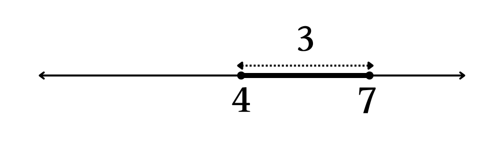
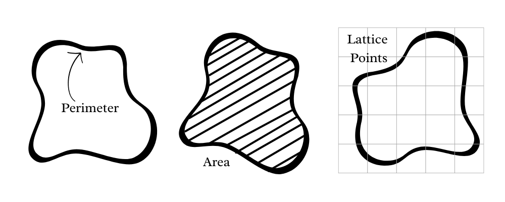

# Why Measure Theory and Fields?

Measure theory, just like it sounds, is a branch of mathematics that deals with, well, *measuring* things. In real life, we're quite used to measuring tangible things, the dimensions of a table, the size of our TV screen, etc.

Let's start with a simple task: measuring a line on $\mathbb{R}$, the reals (fig. 9.3.2.1). Say we need to measure the interval $[4, 7]$ on the real number line. We can all agree that the measure of this is $7 - 4 = 3$. So, we essentially measured the *length* of this segment. However, this so-called specific measurement is unique to the reals. How do we generalize measuring things?

In the previous example, the interval $[4, 7]$ is a collection of points (or *set of points*) $p$ such that $4 \le p \le 7$. Measuring lengths of line segments isn't the only *measure* available to us. There are a various number of *measures* that we can have. Given a certain region in $\mathbb{R}\times \mathbb{R}$ (gig. 9.3.2.2), we may want to measure the *area* bounded by the region, or the *perimeter* of the region, or the *number of lattice points in the region*, and so on. Just taking $\mathbb{R}$ as an example, it is an infinite set. There are an infinite number of subsets of $\mathbb{R}$, and it's quite difficult to measure an infinite number of subsets. Even in this example, we can reduce our problem to measuring sets. The perimeter of the figure is essentially the set of points that falls on the boundary of the said region. The area of the figure is the set of points that are contained inside the said figure. Notice a pattern? We can represent the things we need to measure as sets. 

We can reduce most objects or structures to sets like this. Thus, the natural next step is to concretely define what we're going to be measuring. Now, there was a small technical flaw in what we just covered. *Measuring sets* doesn't really make sense. We need to be able to measure some inherent property of these sets in question. In measure, this property we measure are the *subsets* of the sets in question.

Okay, so we have our objective: Given a set $S$, we're going to measure subsets $A \subseteq S$. Unfortunately, we're still not done. We can't quite measure subsets of all types of sets (example: uncountably infinite sets; naturally, it's quite difficult to define measures on subsets of such sets. We'll come back to these later on though.) So, we need to define what type of sets we actually *can measure*. So we call these sets that we can measure *fields*. Fields just help us define which subsets we're going to measure. The first type of fields we're going to deal with are $\sigma$-fields.

# Definitions and Basics

**Definition**: A $\sigma$-field (also called $\sigma$-algebra) on a set $S$ is a set $\mathcal{F}$ such that each $A \in \mathcal{F}$ also satisfies $A \subseteq S$ such that:

1. $\emptyset \in \mathcal{F}$
2. $A \in \mathcal{F} \Rightarrow A^{c} \in \mathcal{F}$
3. For a sequence of sets $\{A_i\}_{i=1}^{n} \; \forall \; n \in \mathbb{N}$ such that $A_i \in \mathcal{F} \; \forall \; 1 \leq i \leq n$, we also have $\bigcup_{i=1}^{\infty} A_{i} \in \mathcal {F}$

There's the definition. It seems quite abstract, doesn't it? Let's try to work through it step-by-step. The first condition isn't really all that special. It states that the null set is in $\mathcal{F}$. This follows naturally from the proposition that $\mathcal{F}$ is a set. We know that $\emptyset \in X$ for all sets $X$. 

However, the next one's quite interesting. It states that if a subset $A \subseteq S$ is in $\mathcal{F}$, then its complement must also be in $\mathcal{F}$. Let's try to motivate this with an example. Say that you just bought 500g of butter from the supermarket to bake some cookies. You use about 300g of the butter for the cookies. Obviously, if I ask you to tell me how much is left, you're going to answer 200g. How? Well, you knew the initial amount of butter and the amount you used. So the amount that's left is just the initial amount minus the amount you used. We extend this intuition to our $\sigma$-fields as well. Think of the set $S$ as the intial block of butter you bought and think of the subset $A \subseteq S$ as the butter you just used. Obviously, we can measure the amount of butter left: which is the complement of $A$ in $S$, i.e. $A^c$. And that's it: it's that simple.

Let's motivate the third condition as well. It states that the countable union of sets in $\mathcal{F}$ are also in $\mathcal{F}$. Well, we're actually studying measure theoretic probability, aren't we? It doesn't make sense for us to limit ourselves to combinations of just two, or three, or four combinations of outcomes. Even if we are interested in combinations of a finite number of outcomes, it doesn't make sense to limit our possibilities right from the start. It is often incredibly useful to see what happens when our space of probability grows larger and larger and we're able to notice some patterns. This is the reason why the condition involves countable unions of sets. It is important to note that this condition also takes care of the case where we want to deal with a finite number of combinations (unions) as well (look at the problems below).

Let's go through the definition step by step. The first condition tells us that $\mathcal{F}$ contains $\emptyset$, the null set. The second condition tells us that for every subset $A \subseteq S$, the complement $A^c$ of $A$ in $S$ is also contained in $\mathcal{F}$. Finally, the third condition tells us that $\mathcal{F}$ is closed under countable unions of the subsets.

**Question 1**: Show that the first condition $\emptyset \in \mathcal{F}$ is equivalent to $S\in \mathcal{F}$.

**Solution**: From the second condition, we know that 

$$
A \in \mathcal{F} \Rightarrow A^{c} \in \mathcal{F}
$$

So, 

$$
\emptyset \in \mathcal{F} \Rightarrow \emptyset^{c} = S \in \mathcal{F}
$$

**Question 2**: Show that the third condition of $\mathcal{F}$ being closed under countable unions implies that $\mathcal{F}$ is closed under finite unions as well.

**Solution**: In the sequence of sets $A_{i}$ we set $A_i = \emptyset \; \forall \; i \gt n$. This gives:

$$
\bigcup_{i=1}^{\infty} A_{i} \in \mathcal {F} \Rightarrow \bigcup_{i=1}^{n} A_{i} \in \mathcal {F}
$$

because $A \cup \emptyset = A$. This completes our proof.

It turns out that $\sigma$-fields are also closed under countably infinite (and by extension, finite) intersections, set theoretic differences and symmetric differences. We call this fact *closure under countable set operations*.

**Definition:** For a set $A\in \mathcal{F}$ where $\mathcal{F}$ is a $\sigma$-field, we say that $A$ is *measurable* with respect to $\mathcal{F}$. We also say that $A$ is $\mathcal{F}$-measurable.

**Definition:** A pair $(S, \mathcal{F})$ where $S$ is a set and $\mathcal{F}$ is a $\sigma$-field of subsets of $S$ is known as a *measurable space*.

# Additional Problems And Solutions

1. Show that $\mathcal{F}$ being closed under countable set operations can be reduced to the condition that subsets $A, B \subseteq S$ satisfy $A, B \in \mathcal{F} \Rightarrow A * B \in \mathcal{F}$ where $*$ is the set operation in question. ($*$ can be union, intersection, symmetric difference)

Solution: We will prove the proposition using induction. The important thing to note is that union, intersection and symmetric difference on sets is *associative*. Assume that $\mathcal{F}$ is closed under $n$ set operations. The base case $n = 2$ is trivial. Assume that our proposion hold for some $n = k$. Now, we will show that the proposition hold for $n = k + 1$ as well:

$$
\bigcup_{i=1}^{k + 1} A_{i} = (\bigcup_{i=1}^{k} A_{i}) \cup A_{k + 1}
$$

We let 

$$
\bigcup_{i=1}^{k} A_{i} = A, A_{k + 1} = B
$$

By the inductive step, we know that $A \in \mathcal{F}$. And, $A \cup B$ is also in $\mathcal{F}$ as we saw in the base case. This completes our proof. 

2. Prove closure for $\sigma$-fields under the following operations: intersections, set theoretic differences, symmetric differences assuming that closure holds under unions. Feel free to use the result from the previous problem.

Solution: For each of the given operations, we will show that closure hold for 2 subsets $A, B \subseteq S$ such that $A, B \in \mathcal{F}$. This is sufficient to prove the claim following from the result in previous problem. 

By De Morgan's laws, we know that $(A \cap B)^c = A^c \cup B^c$. From the second condition, we know that $A^c$ and $B^c$ are in $\mathcal{F}$. From the third condition we know that $A^c \cup B^c \in \mathcal{F}$. So, $(A \cap B)^c \in \mathcal{F}$. However, from the second condition, $((A \cap B)^c)^c = A \cap B \in \mathcal{F}$. This completes the proof for intersections.

For set theoretic differences, we note that $A - B = A \cap B^c$. We know that $A \in \mathcal{F}$. By the second condition, $B \in \mathcal{F} \Rightarrow B^c \in \mathcal{F}$. Also, we've already proved closure under intersections. This, $A \cap B^c \in \mathcal{F} \Rightarrow A - B \in \mathcal{F}$. This completes the proof for set theoretic differences.

For symmetric differences, we note that $A \; \triangle \; B = (A - B) \cup (B - A)$. We've already proved closure under set theoretic differences. So, $A - B \in \mathcal{F}$ and $B - A \in \mathcal{F}$. We know that closure holds under unions. Hence, $(A - B) \cup (B - A) \in \mathcal{F} \Rightarrow A \; \triangle \; B \in \mathcal{F}$. This completes the proof for symmetric differences. 

3. Show that an intersection of $\sigma$-fields on $S$ is also a $\sigma$-field on $S$.

Solution: Let $\{\mathcal{F}_i\}$ be a family of $\sigma$-fields. Let $\bigcap \mathcal{F}_i = \mathcal{F}$. We first consider some arbitrary set $X$ that is in $\mathcal{F}$. So, 

$$
X \in \mathcal{F} = \bigcap \mathcal{F}_i
\Rightarrow X \in \mathcal{F}_i \; \forall \; i
$$

Due to the second condition, we can write:

$$
X \in \mathcal{F}_i \; \forall \; i
\Rightarrow X^c \in \mathcal{F}_i \; \forall \; i
\Rightarrow X^c \in \bigcap \mathcal{F}_i = \mathcal{F}
$$

Let $P$ be some set of indices. We now write:

$$
X_p \in \bigcap \mathcal{F}_i = \mathcal{F} \; \forall \; p \in P
\Rightarrow X_p \in \mathcal{F}_i \; \forall \; i \; \forall \; p
\Rightarrow \bigcup X_p \in \mathcal{F}_i \; \forall \; i
\Rightarrow \bigcup X_p \in \bigcap \mathcal{F}_i = \mathcal{F}
$$

This completes our proof.

4. Show that the following are $\sigma$-fields for a certain set $S$:
    
    i. The power set $\mathcal{P}(S)$ of $S$

    ii. The set $\{\emptyset, S\}$ (trivial $\sigma$-field)

    iii. The set $\{\emptyset, A, A^c, S\} \; \forall \; A \subset S$

Solution: For part (i), $\mathcal{P}(S)$, by definition, is the set of all subsets of $S$. So, all three conditions are automatically satisfied.

For part (ii), note that $\emptyset \in \{\emptyset, S\}$, so the first condition is satisfied. Also, $\emptyset^c = S \in \{\emptyset, S\}$ and $S^c = \emptyset in \{\emptyset, S\}$. So the second condition is satisfied as well. Finally, observe that $\emptyset \cup S = S \in \{\emptyset, S\}$ (remember we have shown that this condition is sufficient). So the third condition is satisfied as well.

For part (iii), let $\mathcal{F} = \{\emptyset, A, A^c, S\}$. Note that $\emptyset \in \mathcal{F}$, so the first condition is satisfied. Note that $\emptyset^c = S \in \mathcal{F}$, $S^c = \emptyset \in \mathcal{F}$, $A^c = A^c \in \mathcal{F}$ and $(A^c)^c = A \in \mathcal{F}$. So the second condition is satisfied as well. For the third condition, we need to show that the union every combination of two elements from the set is also in $\mathcal{F}$. This is left as an excercise to the reader.

Now that we have our basis of fields, we can start measuring them! We'll study measures in the next section.
