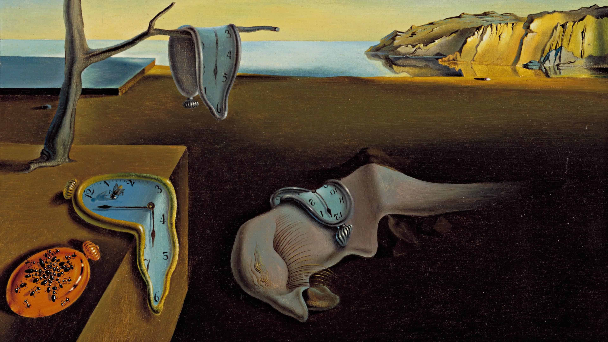

# The Strange Web of Mathematics in Artificial Intelligence

{fig-alt="The Persistence of Memory, Salvador Dalí 1931"}

It's difficult to explain why a mathematical education is important when modern tools minimize our need for it. Tax software crunches arithmetic and advanced AI systems such as ChatGPT handle complex reasoning for us. Engineers typically use pre-built libraries for mathematical processing, reducing their practical need to master math directly.

So, why bother learning mathematics deeply? Some argue for its intrinsic beauty: seeing theorems coming to life. But few appreciate this beauty when preparing for exams or racing toward research deadlines. Mathematics is rarely read for leisure.

Instead, let's draw from practical experience. We, the authors of this book, are AI scientists at top tech companies. Mathematics is a powerful tool, and your grasp of its foundations directly shapes your success in artificial intelligence. Simply put, a solid mathematical foundation is more useful than you might expect when navigating AI research.

Consider a simple example: calculating the mean of $n$ numbers. This should be familiar. Suppose you have $n$ datapoints, $x_1, \ldots, x_n$ all of which are real numbers (positive or negative). The mean is calculated as:

$$
\mu = \frac{1}{n} \sum_{i=1}^{n} x_i
$$

When an additional datapoint arrives, how do you efficiently update the mean? Recomputing from scratch works, but it’s inefficient. Instead, use an **incremental update**:

$$
\mu_{n+1} = \mu_n + \frac{x_{n+1} - \mu_n}{n+1}
$$

You might wonder, "Will I actually need this in real life?". It's a fair question. To test this practically, I ran two programs on my M1 Mac: one recomputed the mean each time, and another used the incremental approach. For $n=10,000$ datapoints, recomputing took 140 milliseconds; the incremental approach took just 2.4 milliseconds. While this difference may be apparent with millions of datapoints, it isn't at the scale of thousands, which we deal with regularly.

So, is the incremental mean just a mathematical curiosity, with no practical value? Not at all. A slight variation of this incremental method is essential for training **multi-armed bandits**, a reinforcement learning algorithm.

Bandit algorithms estimate true means from samples and are fundamental to real-time applications like news recommendations and A/B testing. Here, sub-millisecond latency is mandatory. Suddenly, the incremental mean method shifts from a curiosity to a necessity.

Anyone exploring AI literature knows the feeling: you're cruising through a paper when: BAM! you are suddenly confronted by a dense mathematical equation - perhaps concerning Reproducing Kernel Hilbert Spaces, or something equally complex. 

In that instant, you face two choices:

- **Ignore it**: Saving time now but risking misunderstanding the paper’s core insights.

- **Decode it**: Commit days of intense effort to understand the equation...only for it to fade from your memory within a week, leaving you back where you started the next time it appears.

Fortunately, there’s a third, better approach: **prepare in advance**. A solid mathematical foundation allows for a quick refresher instead of re-learning repeatedly. An early investment in mathematics lets you confidently grasp and apply new concepts.

## To summarize

This book is for students of all ages and backgrounds who seek to master the math that powers artificial intelligence.

As an **AI student**, mastering mathematics early equips you with the tools needed to rapidly grow your future career in the wide fields of artificial intelligence.

As an **AI practitioner**, math is your toolbox. You never know when a concept becomes crucial for algorithm development or in applications.

As an **AI researcher**, you must weave ideas into elegant, interconnected solutions. A strong mathematical foundation unlocks your ability to innovate in creating virtual minds - the defining challenge of our era.
